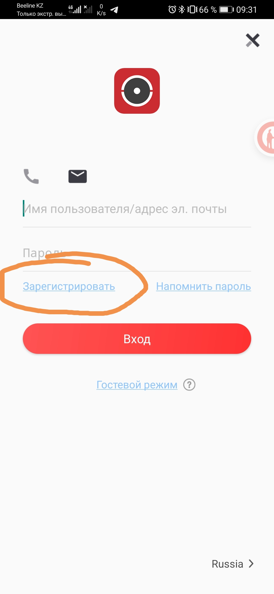
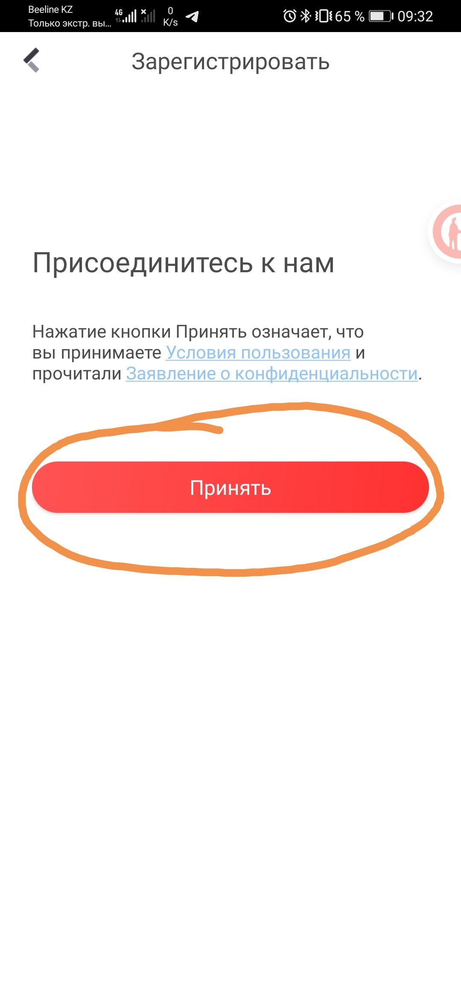
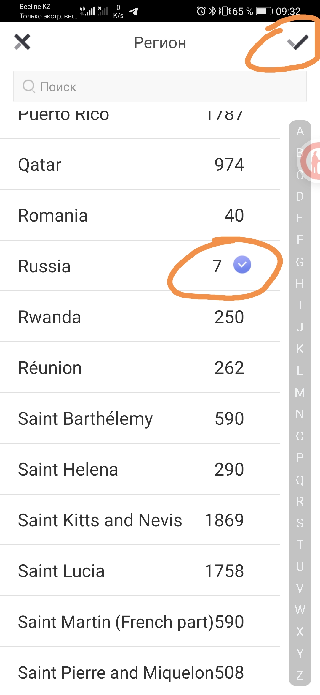
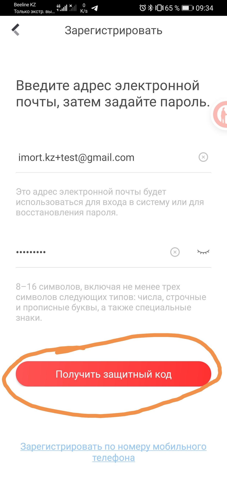
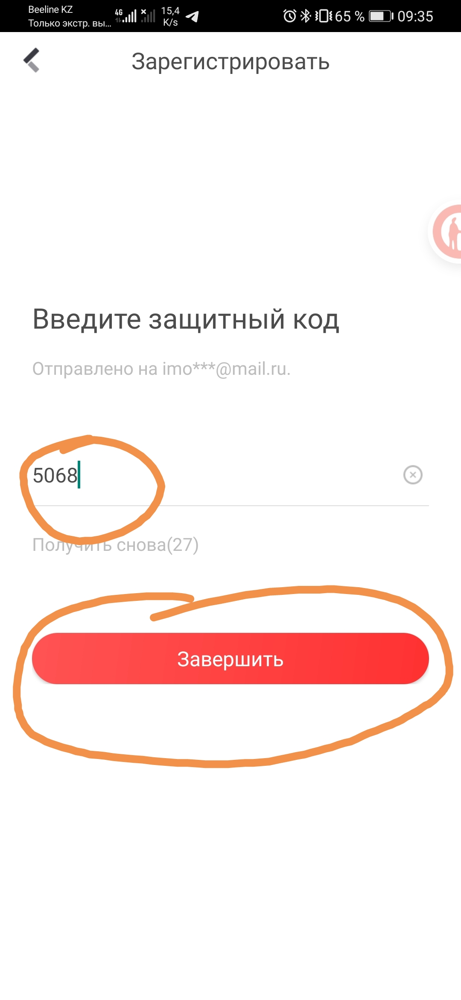
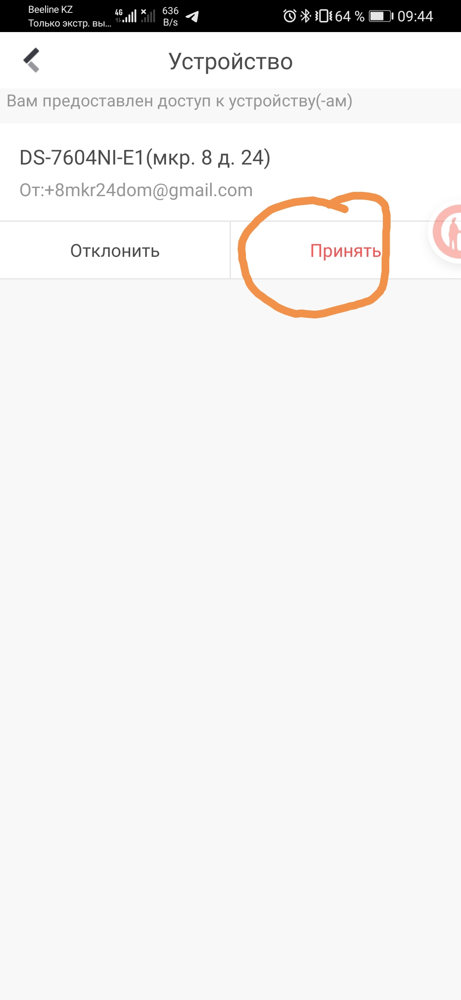
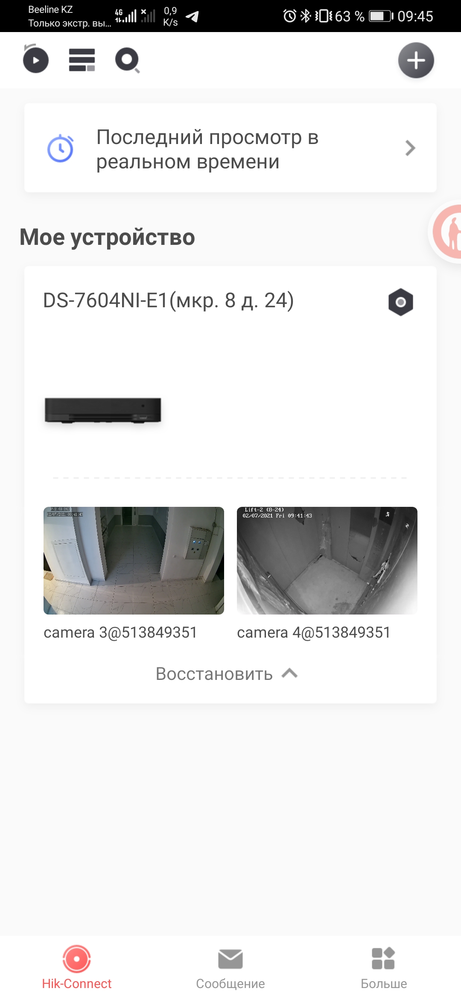
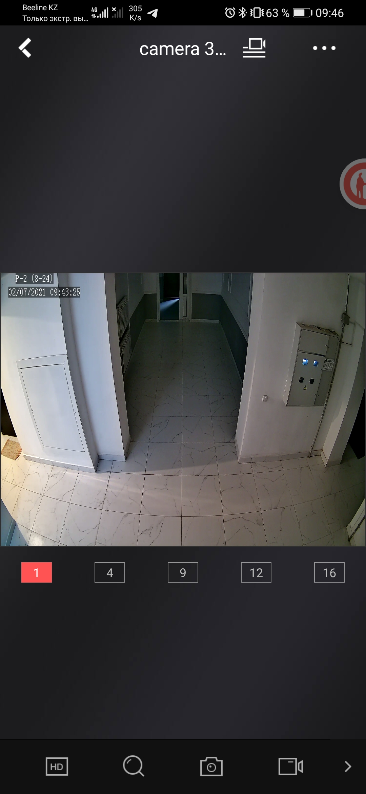
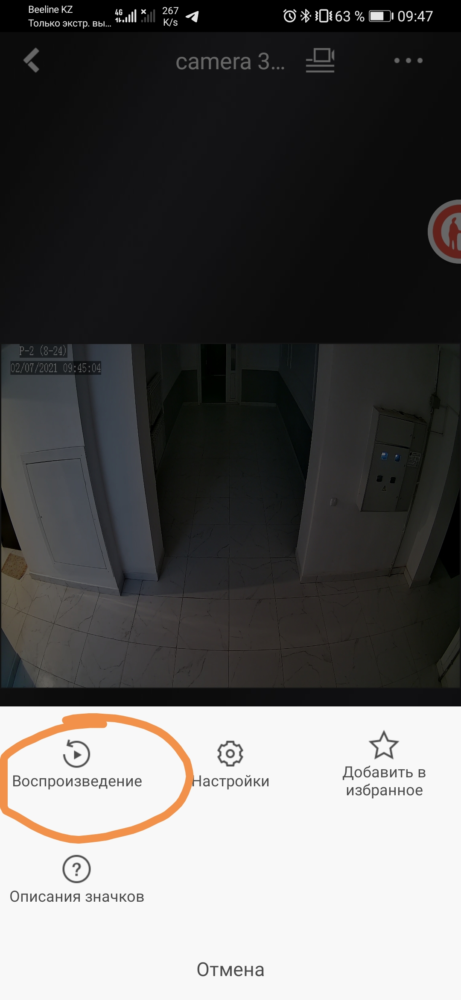
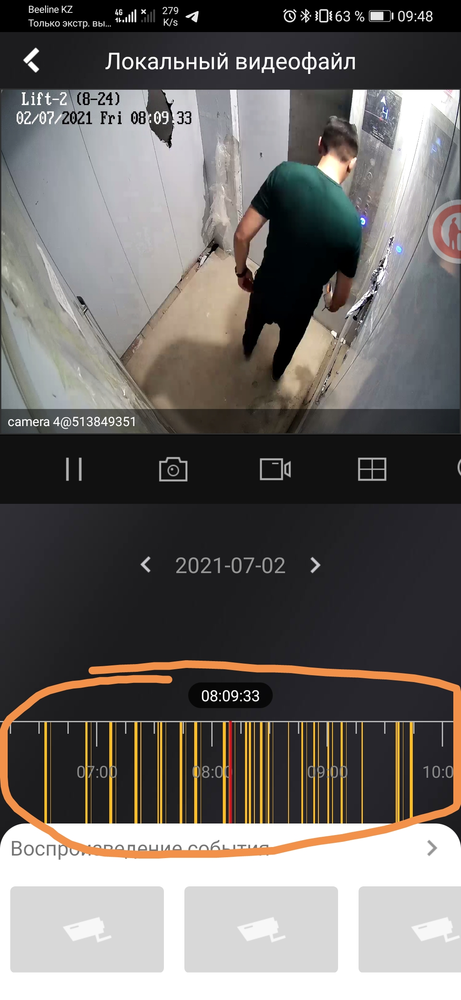

# Настройка доступа к камерам

## Установка приложения

Для Apple: скачать и установит приложение [Hik-connect for End-user](https://apps.apple.com/us/app/hik-connect-for-end-user/id1087803190).

Для Android: скачать [файл](https://appstore.hikvision.com/0yGe) и установить приложение Hik-connect for End-user.

## Регистрация

Зарегистрироваться в приложении:

Принять условия использования:

Выбрать страну "Россия", и продолжить:

Указать свой адрес электронной почты и новый пароль для входа в приложение.

**Внимание:** в пароле должно быть не менее 8 символов: цифры, строчные и прописные буквы, и специальные знаки:

На указанный адрес электронной почты придёт код из 4 цифр, введите его в поле, и нажмите "Завершить":

Регистрация закончена!

## Доступ к камерам

Теперь напишите мне в личку в WhatsApp и укажите, пожалуйста:
 - номер вашей квартиры
 - адрес вашей электронной почты, **которую вы использовали при регистрации**

Я добавлю вам доступ к камерам Вашего подъезда, и пришлю пароль для просмотра видео (его нужно будет ввести только один раз)

Вам придёт уведомление о предоставлении доступа к общему устройству.
Необходимо будет перезапустить приложение, и принять доступ к камерам:

## Использование приложения

Вот так выглядит общий вид доступных Вам камер:

Если выбрать нужную камеру, откроется её вид:

Кнопки внизу:

1. Качество
2. Увеличение 
3. Сохранить фото
4. Сохранить видеозапись

Кнопка ... в верхнем правом углу предоставляет доступ к архиву:

Временную полосу внизу можно прокручивать. Для камер в лифтах жёлтые отметки показывают движение в кадре.

## Регистрация дополнительного устройства

Можно зарегистрировать до двух устройств на учётную запись.

На новом устройстве (телефоне, планшете) нужно просто войти с той же учётной записью, регистрироваться заново **не нужно**.